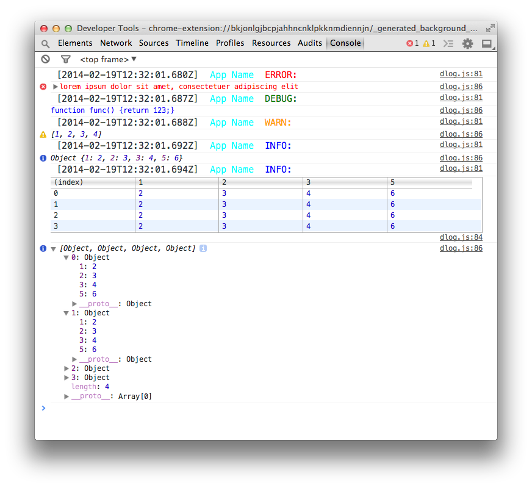
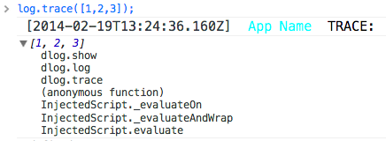
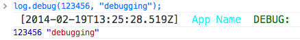
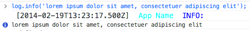
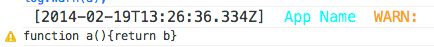
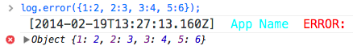
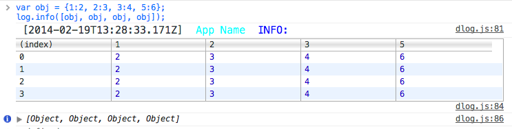

dlog
====

a Simple &amp; Beautiful Logging for Browser



## Features

* Colorful.
* Font size customize.
* Timestamp.
* Log levels: trace, debug, info, warn, error.
* Silent mode. (for production)
* Limit logs by level.

## Installation

Download dlog.js [here](https://github.com/ddo/dlog/blob/v0.0.1/dlog.min.js)

    <script src="oauth-1.0a.js"></script>
    
### Init

```js
var log = new dlog();
```

## Levels (in order)

* trace
* debug
* info
* warn
* error
* silent

## Usage

### init

```js
var log = new dlog({
	name: "App Name",
	size: 20, //font size
	level: "info"
});
```

### .log(level, data)

```js
log('info', data);
```

```js
log('debug', data]);
```

...

### .{level}(data)

```js
log.trace(data);
```

```js
log.warn(data);
```

```js
log.error(data);
```

...

### .setSize()

* Default: 14px
* Set font size

```js
log.setSize(19);
```

### .setName()

* Default: "Ddo"
* Set App name, you may have many apps to log.

```js
log.setName("App Name");
```

### .setLevel()

* Default: "info"
* Set app logging level to limit the logs base on level in console.
* For example, if app level is "info" then all the "trace" and "debug" level logs will not show.
* Set level to "silent" to stop all log. (good for production)

```js
log.setName("silent");
```
## Examples

### log.trace



### log.debug



### log.info



### log.warn



### log.error



### log.silent

Nothing !!!

### Table

Table will show if data is a array of objects



## License

MIT © [Ddo](http://ddo.me)